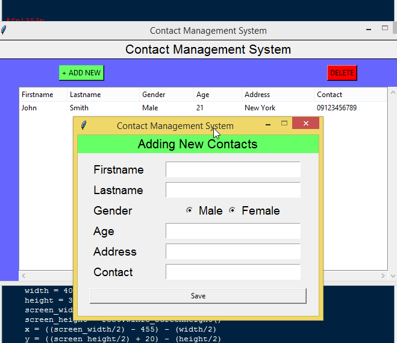

# Contact Management System Project in Python
This Contact Management System is a Python program that can manage the list of contact information. The purpose of the system is to organize the list of all available contacts such as by inputting names and contact numbers. This program was built using only Python language.

# About the Project
The project is a simple GUI application that uses the Tkinter module in order to create a design view. The system can be accessed without the use of login information. The user can add a new contact by providing personal details such as first name, last name, gender, address, and contact number. The system table can also be updating the contact list if he/she double click the row of that particular data. The system was made simpler so that beginners can learn and enhance their programming skills in developing the python language.

# Features:
* The user can view the list of all contact as soon as the application has launched.
* You can freely add more contacts by supplying the needed details.
* The system has a function that can update the list of contact by double-clicking the targeted row and change the data in the input field.
* The system also allowed to delete some contact by clicking the targeted row and click the delete button

# Installation:
1. You will have to download & install the Python IDLE's, here's the link https://www.python.org/downloads/.
2. Extract the zip file.
3. Open the extracted folder
4. Locate the py file.
5. Then open the file via Python IDLE.
6. Run the py file to launch the program.

FOR YOUR OWN SAFETY, PLEASE:

1. Re-scan downloaded files using your personal virus checker before using it.
2. NEVER, EVER run compiled files (.exe's, .ocx's, .dll's etc.)--only run source code.
